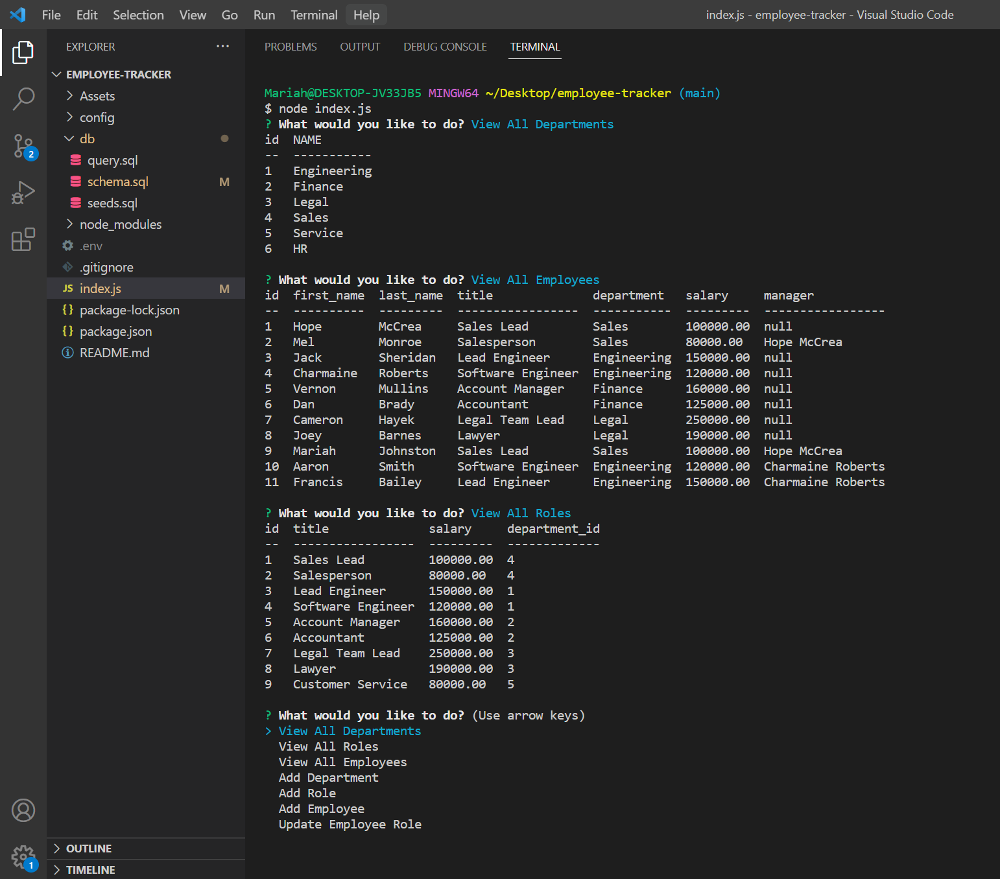

# Employee Tracker

## Description

Employee Tracker is a command line application that allows you to keep track of and manage your employees, their roles, salary, department and who their manager is. You can select from the drop down: view all departments, view all roles, view all employees, add employee, add role, and update role. This application makes it very simple to organize and plan your business.

## Table of Contents (Optional)

If your README is long, add a table of contents to make it easy for users to find what they need.

- [Installation](#installation)
- [Usage](#usage)
- [Credits](#credits)
- [License](#license)

## Installation

To get started with this command line application, there are several libraries you will need to install: console.table, dotenv, inquirer, mysql and mysql2. To install these, simply go to your terminal and type in npm i (*insert library name here*) and hit enter. Once everything is installed, you will open a new terminal and type in node index.js and it will display the main menu for you to select from. 

## Usage

## Credits

I take credit for my code. I had some help from my TA Brian Baker fixing some bugs in my code.

## License

MIT License

Copyright (c) [2022] [Mariah Johnston]

Permission is hereby granted, free of charge, to any person obtaining a copy
of this software and associated documentation files (the "Software"), to deal
in the Software without restriction, including without limitation the rights
to use, copy, modify, merge, publish, distribute, sublicense, and/or sell
copies of the Software, and to permit persons to whom the Software is
furnished to do so, subject to the following conditions:

The above copyright notice and this permission notice shall be included in all
copies or substantial portions of the Software.

THE SOFTWARE IS PROVIDED "AS IS", WITHOUT WARRANTY OF ANY KIND, EXPRESS OR
IMPLIED, INCLUDING BUT NOT LIMITED TO THE WARRANTIES OF MERCHANTABILITY,
FITNESS FOR A PARTICULAR PURPOSE AND NONINFRINGEMENT. IN NO EVENT SHALL THE
AUTHORS OR COPYRIGHT HOLDERS BE LIABLE FOR ANY CLAIM, DAMAGES OR OTHER
LIABILITY, WHETHER IN AN ACTION OF CONTRACT, TORT OR OTHERWISE, ARISING FROM,
OUT OF OR IN CONNECTION WITH THE SOFTWARE OR THE USE OR OTHER DEALINGS IN THE
SOFTWARE.